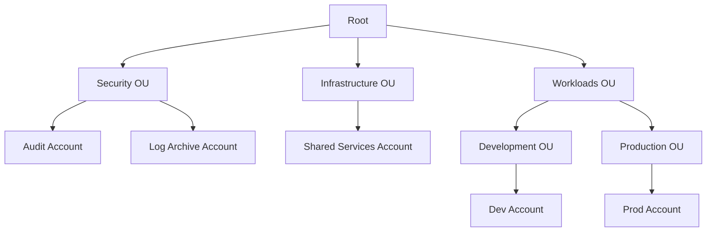
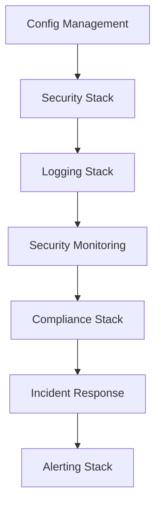

# Multi-Account AWS Bootstrap Framework

[](https://opensource.org/licenses/Apache-2.0)

A comprehensive Infrastructure as Code (IaC) solution for establishing secure, scalable AWS Organizations with centralized logging and governance. Originally developed for SynapseD, this framework is designed to be reusable for any organization requiring robust AWS account management.

## Original Use Case: SynapseD

SynapseD is a startup developing a secure notes application with these key features:
- Local-first architecture: Data primarily stored on user devices
- Peer-to-peer (P2P) communication: Direct encrypted sharing between users
- End-to-end encryption: Ensures data privacy and security

While SynapseD's initial infrastructure needs are modest, this framework implements enterprise-grade AWS account structure and security controls. This forward-thinking approach allows:
- Seamless scaling as the user base grows
- Easy addition of new applications and services
- Consistent governance across all AWS resources

## Organization Structure



## Stack Dependencies



## Implementation Components

### 1. Configuration Management
- **Parameter Store**: Central configuration storage
- **Secrets Manager**: Secure secrets management
- **AppConfig**: Feature flags and dynamic configuration
- **KMS**: Optional encryption for sensitive data
- **Environment Configuration**: Type-safe environment variable handling with validation

### 2. AWS Organizations & IAM Roles
- **Security Audit Role**: Cross-account security auditing
  - Organization-wide access
  - SecurityAudit and AWSConfigUserAccess policies
  - OU-aware permissions
- **Logging Read Role**: Centralized logging access
  - S3 bucket read permissions
  - CloudWatch Logs access
  - Organization-wide scope

### 3. Centralized Security Monitoring
- **GuardDuty**: Threat detection across accounts
  - S3 Logs monitoring
  - Kubernetes audit logs
  - Malware protection
  - Finding publishing frequency: 15 minutes
- **Security Hub**: Security finding aggregation
  - AWS Foundational Security Best Practices
  - CIS AWS Foundations Benchmark
  - PCI DSS compliance checks
  - Custom severity thresholds
- **Cross-Account Visibility**: Unified security dashboard

### 4. Compliance Enforcement
- **AWS Config Rules**:
  - S3 Bucket Encryption
  - Root User Activity Monitoring
  - MFA Enforcement
  - Custom Compliance Rules
- **Delivery Channel**: Configurable snapshot frequency
- **Global Resource Types**: Optional inclusion in recording

### 5. Automated Incident Response
- **Lambda Functions**:
  - Suspicious Activity Handler
  - Security Finding Processor
  - Configurable severity thresholds
- **EventBridge Rules**:
  - Real-time incident detection
  - Security Hub finding processing
  - Automated responses

### 6. Security Alerting
- **SNS Topics**:
  - Critical Security Alerts
  - Compliance Violations
  - Audit Events
- **Multiple Notification Methods**:
  - Email notifications (required)
  - SMS alerts (optional)
  - Configurable severity thresholds
  - High severity threshold customization

## Prerequisites

1. **System Requirements**
   - Node.js (v14 or later)
   - npm (v7 or later)
   - AWS CLI v2

2. **AWS Setup**
   ```bash
   npm install -g aws-cdk
   aws configure
   ```

3. **Required Permissions**
   - Organizations Admin
   - IAM Admin
   - Security Services Access

## Installation

```bash
git clone <repository-url>
cd multi-account-bootstrap
npm install
```

## Configuration

### Environment Variables

1. **Required Environment Variables**
   ```plaintext
   CDK_DEFAULT_ACCOUNT=<root-account-id>    # Your AWS root account ID
   CDK_DEFAULT_REGION=<preferred-region>    # e.g., ap-southeast-2
   SECURITY_TEAM_EMAIL=<email>              # Email for security alerts
   ```

2. **Optional Environment Variables**
   ```plaintext
   STACK_PREFIX="Security"                  # Prefix for all stack names
   ENV_NAME="Dev"                          # Environment name (Dev, Prod, etc.)
   PROJECT_NAME="aws-synapsed-bootstrap"    # Project identifier
   SECURITY_TEAM_PHONE="+1234567890"       # Phone number for SMS alerts
   HIGH_SEVERITY_THRESHOLD="7"             # Threshold for high severity alerts
   AWS_ORG_ID="o-xxxxxxxxxx"              # AWS Organizations ID
   ```

### Stack Configuration

Each stack extends the `BaseStack` class and implements specific security and compliance requirements. The stacks are deployed in a specific order to ensure proper dependency management:

1. **Config Management Stack**
   - First to deploy
   - Sets up central configuration
   - No dependencies

2. **Security Stack**
   - Depends on Config Management
   - Sets up IAM roles and permissions
   - Organization-wide scope

3. **Logging Stack**
   - Depends on Security Stack
   - Centralized logging infrastructure
   - S3 and CloudWatch Logs setup

4. **Security Monitoring Stack**
   - Depends on Logging Stack
   - GuardDuty and Security Hub setup
   - Cross-account monitoring

5. **Compliance Stack**
   - Depends on Security Monitoring
   - AWS Config rules
   - Compliance enforcement

6. **Incident Response Stack**
   - Depends on Compliance Stack
   - Automated response setup
   - EventBridge rules

7. **Alerting Stack**
   - Depends on Incident Response
   - SNS topics and subscriptions
   - Notification configuration

## Development

### Testing
```bash
npm test
```

### Deployment
```bash
cdk deploy --all
```

## Contributing

1. Fork the repository
2. Create a feature branch
3. Commit your changes
4. Push to the branch
5. Create a Pull Request

## License

This project is licensed under the Apache License 2.0 - see the [LICENSE](LICENSE) file for details.