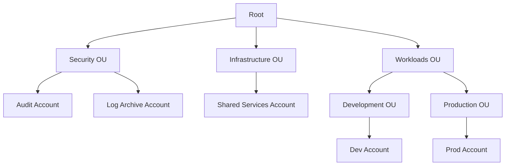

# Multi-Account AWS Bootstrap Framework

[](https://opensource.org/licenses/Apache-2.0)

A comprehensive Infrastructure as Code (IaC) solution for establishing secure, scalable AWS Organizations with centralized logging and governance. Originally developed for SynapseD, this framework is designed to be reusable for any organization requiring robust AWS account management.

## Original Use Case: SynapseD

SynapseD is a startup developing a secure notes application with these key features:
- Local-first architecture: Data primarily stored on user devices
- Peer-to-peer (P2P) communication: Direct encrypted sharing between users
- End-to-end encryption: Ensures data privacy and security

While SynapseD's initial infrastructure needs are modest, this framework implements enterprise-grade AWS account structure and security controls. This forward-thinking approach allows:
- Seamless scaling as the user base grows
- Easy addition of new applications and services
- Consistent governance across all AWS resources

## Organization Structure



## Implementation Components

### 1. Configuration Management
- **Parameter Store**: Central configuration storage
- **Secrets Manager**: Secure secrets management
- **AppConfig**: Feature flags and dynamic configuration
- **KMS**: Optional encryption for sensitive data

### 2. AWS Organizations & IAM Roles
- **Security Audit Role**: Cross-account security auditing
- **Logging Read Role**: Centralized logging access
- **Cross-OU Permissions**: Organization-wide security policies

### 3. Centralized Security Monitoring
- **GuardDuty**: Threat detection across accounts
  - S3 Logs monitoring
  - Kubernetes audit logs
  - Malware protection
- **Security Hub**: Security finding aggregation
  - AWS Foundational Security Best Practices
  - CIS AWS Foundations Benchmark
  - PCI DSS compliance checks
- **Cross-Account Visibility**: Unified security dashboard

### 4. Compliance Enforcement
- **AWS Config Rules**:
  - S3 Bucket Encryption
  - Root User Activity Monitoring
  - MFA Enforcement
  - Custom Compliance Rules
- **Delivery Channel**: Configurable snapshot frequency
- **Global Resource Types**: Optional inclusion in recording

### 5. Automated Incident Response
- **Lambda Functions**:
  - Suspicious Activity Handler
  - Security Finding Processor
- **EventBridge Rules**:
  - Real-time incident detection
  - Configurable severity thresholds
  - Automated responses

### 6. Security Alerting
- **SNS Topics**:
  - Critical Security Alerts
  - Compliance Violations
  - Audit Events
- **Multiple Notification Methods**:
  - Email notifications
  - Optional SMS alerts
  - Configurable severity thresholds

## Prerequisites

1. **System Requirements**
   - Node.js (v14 or later)
   - npm (v7 or later)
   - AWS CLI v2

2. **AWS Setup**
   ```bash
   npm install -g aws-cdk
   aws configure
   ```

3. **Required Permissions**
   - Organizations Admin
   - IAM Admin
   - Security Services Access

## Installation

```bash
git clone <repository-url>
cd multi-account-bootstrap
npm install
```

## Configuration

### Environment Variables

1. **Required Environment Variables**
   ```plaintext
   CDK_DEFAULT_ACCOUNT=<root-account-id>    # Your AWS root account ID
   CDK_DEFAULT_REGION=<preferred-region>    # e.g., ap-southeast-2
   SECURITY_TEAM_EMAIL=<email>              # Email for security alerts
   ```

2. **Optional Environment Variables**
   ```plaintext
   STACK_PREFIX="Security"                  # Prefix for all stack names
   ENV_NAME="Dev"                          # Environment name (Dev, Prod, etc.)
   PROJECT_NAME="aws-synapsed-bootstrap"    # Project identifier
   SECURITY_TEAM_PHONE="+1234567890"       # Phone number for SMS alerts (optional)
   HIGH_SEVERITY_THRESHOLD="7"             # Threshold for high severity alerts (default: 7)
   ```

### Stack Configuration

Each stack extends the `