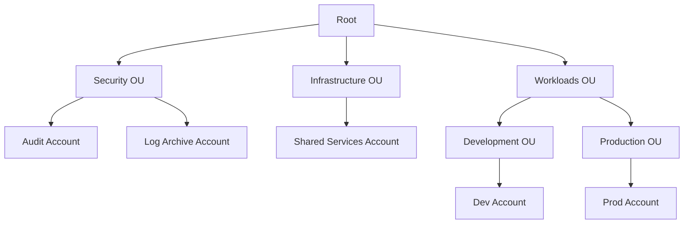
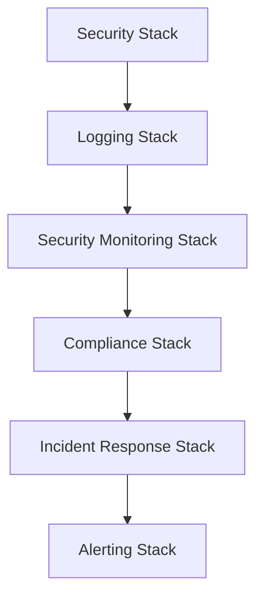

# Multi-Account AWS Bootstrap Framework

[](https://opensource.org/licenses/Apache-2.0)

A comprehensive Infrastructure as Code (IaC) solution for establishing secure, scalable AWS Organizations with centralized logging and governance. Originally developed for SynapseD, this framework is designed to be reusable for any organization requiring robust AWS account management.

## Original Use Case: SynapseD

SynapseD is a startup developing a secure notes application with these key features:
- Local-first architecture: Data primarily stored on user devices
- Peer-to-peer (P2P) communication: Direct encrypted sharing between users
- End-to-end encryption: Ensures data privacy and security

While SynapseD's initial infrastructure needs are modest, this framework implements enterprise-grade AWS account structure and security controls. This forward-thinking approach allows:
- Seamless scaling as the user base grows
- Easy addition of new applications and services
- Consistent governance across all AWS resources

## Organization Structure



## Implementation Components

### 1. AWS Organizations & IAM Roles
- **Security Audit Role**: Cross-account security auditing
- **Logging Read Role**: Centralized logging access
- **Cross-OU Permissions**: Organization-wide security policies

### 2. Centralized Security Monitoring
- **GuardDuty**: Threat detection across accounts
- **Security Hub**: Security finding aggregation
- **Cross-Account Visibility**: Unified security dashboard

### 3. Compliance Enforcement
- **AWS Config Rules**:
  - S3 Bucket Encryption
  - Root User Activity Monitoring
  - MFA Enforcement
  - Custom Compliance Rules

### 4. Automated Incident Response
- **Lambda Functions**:
  - Suspicious Activity Handler
  - Security Finding Processor
- **EventBridge Rules**:
  - Real-time incident detection
  - Automated responses

### 5. Security Alerting
- **SNS Topics**:
  - Critical Security Alerts
  - Compliance Violations
  - Audit Events

## Prerequisites

1. **System Requirements**
   - Node.js (v14 or later)
   - npm (v7 or later)
   - AWS CLI v2

2. **AWS Setup**
   ```bash
   npm install -g aws-cdk
   aws configure
   ```

3. **Required Permissions**
   - Organizations Admin
   - IAM Admin
   - Security Services Access

## Installation

```bash
git clone <repository-url>
cd multi-account-bootstrap
npm install
```

## Configuration

### Environment Variables

1. **Required Before Running Scripts**
   Create a `.env` file with these mandatory variables:
   ```plaintext
   CDK_DEFAULT_ACCOUNT=<root-account-id>    # Your AWS root account ID
   CDK_DEFAULT_REGION=<preferred-region>    # e.g., ap-southeast-2
   SECURITY_TEAM_EMAIL=<email>              # Security team notification email
   ```

2. **Automatically Updated by Scripts**
   The following variables will be populated by `npm run bootstrap`:
   ```plaintext
   AWS_ORG_ID=           # Generated when creating organization
   SECURITY_OU_ID=       # Generated when creating Security OU
   WORKLOADS_OU_ID=      # Generated when creating Workloads OU
   ```

3. **Optional Variables**
   Customize your deployment with these settings:
   ```plaintext
   STACK_PREFIX=         # Default: "Security"
   ENV_NAME=            # Default: "Dev"
   SECURITY_TEAM_PHONE=  # Phone number for SMS alerts (with country code)
   ```

### Bootstrap Process

1. **Organization Setup**
   ```bash
   npm run bootstrap
   ```
   This command will:
   - Create AWS Organization (if none exists)
   - Set up Security and Workloads OUs
   - Update `.env` with generated IDs
   - Create required accounts

2. **CDK Bootstrap**
   ```bash
   cdk bootstrap aws://<account-id>/<region>
   ```
   Required for each deployment account

### Side Effects

Running the bootstrap process will:

- **AWS Organization**
  - Create new organization if none exists
  - Set up organizational units
  - Configure organization defaults

- **Local Environment**
  - Update `.env` file with new IDs
  - Create service-linked roles

- **Account Structure**
  - Create security and workload accounts
  - Configure cross-account access

### Order of Operations

1. Set required environment variables
   ```bash
   # Edit .env file with your account details
   notepad .env
   ```

2. Run bootstrap command
   ```bash
   npm run bootstrap
   ```

3. Verify environment setup
   ```bash
   # Check .env was updated
   type .env
   ```

4. Bootstrap CDK in accounts
   ```bash
   # Root account
   cdk bootstrap aws://<root-account>/<region>
   
   # Each member account
   cdk bootstrap aws://<member-account>/<region>
   ```

5. Deploy stacks
   ```bash
   npm run deploy
   ```

### Troubleshooting

If bootstrap fails to update `.env`:

1. Check AWS credentials
   ```bash
   aws sts get-caller-identity
   ```

2. Verify Organizations access
   ```bash
   aws organizations describe-organization
   ```

3. Run bootstrap with verbose logging
   ```bash
   npm run bootstrap -- --verbose
   ```

## Deployment

### Sequential Stack Deployment
```bash
npm run deploy:security    # Deploy Security Stack
npm run deploy:logging    # Deploy Logging Stack
npm run deploy:monitoring # Deploy Security Monitoring
npm run deploy:compliance # Deploy Compliance Rules
npm run deploy:incident   # Deploy Incident Response
npm run deploy:alerting   # Deploy Alerting
```

### Full Deployment
```bash
npm run deploy
```

## Development Commands

```bash
npm run build   # Compile TypeScript
npm run watch   # Watch mode
npm run test    # Run tests
npm run synth   # Generate CloudFormation
npm run list    # List all stacks
```

## Stack Dependencies



## Customization

### 1. Stack Modification
Each stack can be customized in `lib/stacks/`:
- `security-stack.ts`
- `logging-stack.ts`
- `security-monitoring-stack.ts`
- `compliance-stack.ts`
- `incident-response-stack.ts`
- `alerting-stack.ts`

### 2. Adding New Stacks
1. Create new stack in `lib/stacks/`
2. Import in `bin/multi-account-bootstrap.ts`
3. Add deployment script in `package.json`

## Why Not AWS Control Tower?

This framework provides a lightweight alternative to Control Tower:
- **Simplified Management**: Less overhead for small to medium organizations
- **Custom Control**: Direct modification of security controls
- **Cost Effective**: No additional AWS charges
- **Migration Path**: Can transition to Control Tower if needed

## Benefits for Other Organizations

1. **Scalability**
   - Start small, scale as needed
   - No restructuring required
   - Modular stack design

2. **Security**
   - Defense in depth
   - Automated responses
   - Compliance ready

3. **Cost Management**
   - Account separation
   - Resource isolation
   - Clear cost attribution

## Contributing

1. Fork the repository
2. Create a feature branch
3. Submit a pull request

## Support

Create an issue for:
- Bug reports
- Feature requests
- Implementation questions

## License

This project is licensed under the Apache License 2.0 - see the [LICENSE](LICENSE) file for details.

## Acknowledgments

- AWS CDK team
- AWS Organizations best practices
- Security compliance frameworks