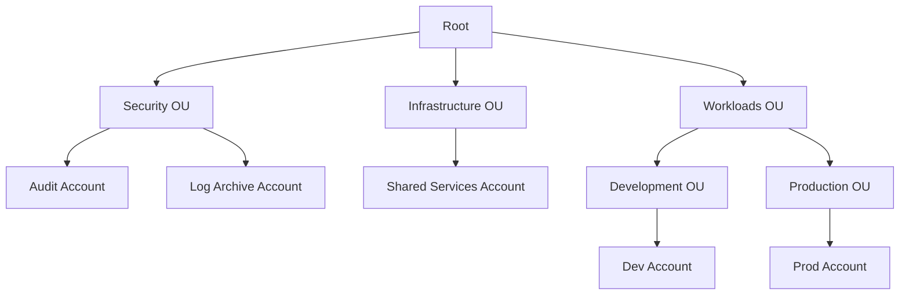
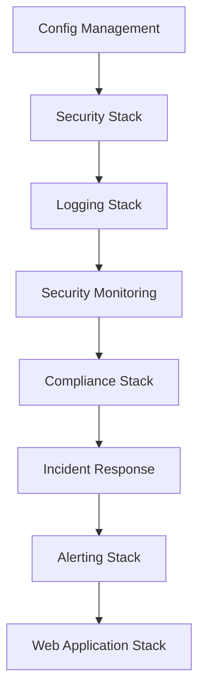

# Multi-Account AWS Bootstrap Framework

[](https://opensource.org/licenses/Apache-2.0)

A comprehensive Infrastructure as Code (IaC) solution for establishing secure, scalable AWS Organizations with centralized logging and governance. Originally developed for SynapseD, this framework is designed to be reusable for any organization requiring robust AWS account management.

## Original Use Case: SynapseD

SynapseD is a startup developing a secure notes application with these key features:
- Local-first architecture: Data primarily stored on user devices
- Peer-to-peer (P2P) communication: Direct encrypted sharing between users
- End-to-end encryption: Ensures data privacy and security
- Real-time WebSocket communication: Enables instant message delivery and presence detection

While SynapseD's initial infrastructure needs are modest, this framework implements enterprise-grade AWS account structure and security controls. This forward-thinking approach allows:
- Seamless scaling as the user base grows
- Easy addition of new applications and services
- Consistent governance across all AWS resources

## Organization Structure



## Stack Dependencies



## Implementation Components

### 1. Configuration Management
- **Parameter Store**: Central configuration storage
- **Secrets Manager**: Secure secrets management
- **AppConfig**: Feature flags and dynamic configuration
- **KMS**: Optional encryption for sensitive data
- **Environment Configuration**: Type-safe environment variable handling with validation

### 2. AWS Organizations & IAM Roles
- **Security Audit Role**: Cross-account security auditing
  - Organization-wide access
  - SecurityAudit and AWSConfigUserAccess policies
  - OU-aware permissions
- **Logging Read Role**: Centralized logging access
  - S3 bucket read permissions
  - CloudWatch Logs access
  - Organization-wide scope

### 3. Centralized Security Monitoring
- **GuardDuty**: Threat detection across accounts
  - S3 Logs monitoring
  - Kubernetes audit logs
  - Malware protection
  - Finding publishing frequency: 15 minutes
- **Security Hub**: Security finding aggregation
  - AWS Foundational Security Best Practices
  - CIS AWS Foundations Benchmark
  - PCI DSS compliance checks
  - Custom severity thresholds
- **Cross-Account Visibility**: Unified security dashboard

### 4. Compliance Enforcement
- **AWS Config Rules**:
  - S3 Bucket Encryption
  - Root User Activity Monitoring
  - MFA Enforcement
  - Custom Compliance Rules
- **Delivery Channel**: Configurable snapshot frequency
- **Global Resource Types**: Optional inclusion in recording

### 5. Automated Incident Response
- **Lambda Functions**:
  - Suspicious Activity Handler
  - Security Finding Processor
  - Configurable severity thresholds
- **EventBridge Rules**:
  - Real-time incident detection
  - Security Hub finding processing
  - Automated responses

### 6. Security Alerting
- **SNS Topics**:
  - Critical Security Alerts
  - High Severity Findings
  - Compliance Violations
- **Email Notifications**: Configurable recipients
- **SMS Alerts**: Optional phone number integration

### 7. Web Application Infrastructure
- **WebSocket API**:
  - Real-time communication
  - Connection management
  - Message routing
  - Redis-based state management
- **Landing Page**:
  - S3 static hosting
  - CloudFront distribution
  - WAF protection
- **Notes Application**:
  - API Gateway endpoints
  - Lambda functions
  - DynamoDB tables
  - WebSocket support

## Recent Improvements

### AWS SDK Migration
- Migrated from AWS SDK v2 to v3 for improved performance and modern features
- Updated DynamoDB client implementation
- Enhanced error handling and type safety

### Testing Infrastructure
- Improved test coverage (97.05% statements, 90.36% branches)
- Enhanced WebSocket testing with proper mocking
- Updated Jest configuration for better TypeScript support
- Added comprehensive error handling tests

### Code Quality
- Enhanced type safety with strict TypeScript checks
- Improved error handling with proper error types
- Better logging with structured error messages
- Cleaner code organization and modularity

## Getting Started

1. Clone the repository:
   ```bash
   git clone https://github.com/your-org/aws-synapsed-bootstrap.git
   cd aws-synapsed-bootstrap
   ```

2. Install dependencies:
   ```bash
   npm install
   ```

3. Configure environment variables:
   ```bash
   cp .env.example .env
   # Edit .env with your configuration
   ```

4. Run tests:
   ```bash
   npm test
   ```

5. Deploy the stacks:
   ```bash
   npm run deploy
   ```

## Development

### Prerequisites
- Node.js 18.x or later
- AWS CLI configured with appropriate credentials
- TypeScript 5.x
- Jest for testing

### Testing
```bash
# Run all tests
npm test

# Run tests with coverage
npm run test:coverage

# Run specific test file
npm test -- test/websocket/index.test.ts
```

### Building
```bash
# Build the project
npm run build

# Clean build artifacts
npm run clean
```

## Contributing

1. Fork the repository
2. Create your feature branch (`git checkout -b feature/amazing-feature`)
3. Commit your changes (`git commit -m 'Add some amazing feature'`)
4. Push to the branch (`git push origin feature/amazing-feature`)
5. Open a Pull Request

## License

This project is licensed under the Apache License 2.0 - see the [LICENSE](LICENSE) file for details.

## Acknowledgments

- AWS CDK team for the excellent infrastructure as code framework
- SynapseD team for the original use case and requirements
- All contributors who have helped improve this framework