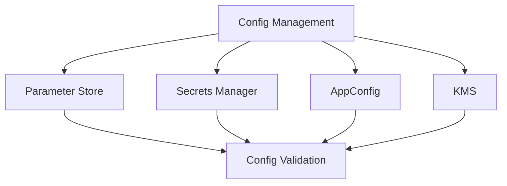
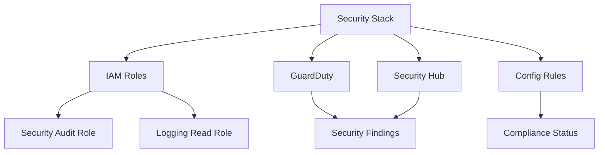
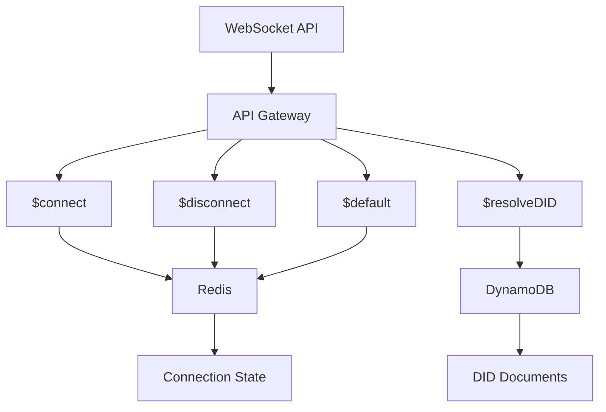
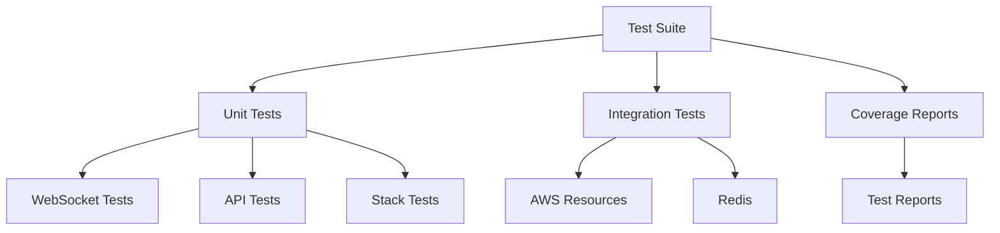
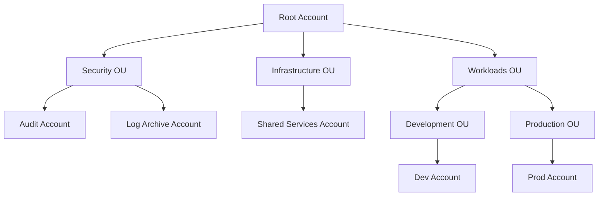
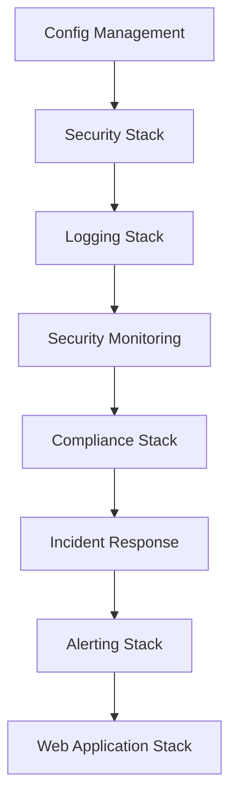

# AWS Synapsed Bootstrap Architecture

## Overview

The AWS Synapsed Bootstrap project implements a secure, scalable, and maintainable multi-account AWS organization using AWS CDK. This document outlines the architecture, technology choices, and rationale behind the design decisions.

## Stack Architecture

### 1. Config Management Stack
**Purpose**: Centralized configuration management for the entire organization.

**Components**:
- AWS Systems Manager Parameter Store
- AWS Secrets Manager
- AWS AppConfig

**Rationale**:
- **Parameter Store**: Chosen over environment variables for its hierarchical structure and versioning capabilities
- **Secrets Manager**: Selected for its automatic rotation capabilities and integration with other AWS services
- **AppConfig**: Provides feature flag management and application configuration management

### 2. Security Stack
**Purpose**: Core security infrastructure and IAM roles.

**Components**:
- IAM Roles and Policies
- KMS Keys
- Security Groups

**Rationale**:
- **IAM**: Using AWS IAM for fine-grained access control and role-based access
- **KMS**: Centralized key management for encryption across services
- **Security Groups**: Network-level security controls

### 3. Logging Stack
**Purpose**: Centralized logging infrastructure.

**Components**:
- CloudWatch Logs
- CloudWatch Logs Insights
- Log Groups and Log Streams

**Rationale**:
- **CloudWatch**: Chosen over ELK Stack for native AWS integration and cost-effectiveness
- **Logs Insights**: Provides powerful querying capabilities without additional infrastructure
- **Log Groups**: Enables organized log management and retention policies

### 4. Security Monitoring Stack
**Purpose**: Security monitoring and threat detection.

**Components**:
- AWS GuardDuty
- AWS Security Hub
- AWS Config

**Rationale**:
- **GuardDuty**: Provides intelligent threat detection using machine learning
- **Security Hub**: Offers centralized security posture management
- **Config**: Enables continuous monitoring of resource configurations

### 5. Compliance Stack
**Purpose**: Compliance and governance controls.

**Components**:
- AWS Config Rules
- AWS Organizations Policies
- AWS Control Tower (optional)

**Rationale**:
- **Config Rules**: Automated compliance checking and remediation
- **Organizations Policies**: Centralized policy management across accounts
- **Control Tower**: Provides a framework for multi-account governance

### 6. Incident Response Stack
**Purpose**: Automated incident response and remediation.

**Components**:
- AWS Lambda
- AWS EventBridge
- AWS Step Functions

**Rationale**:
- **Lambda**: Serverless compute for automated responses
- **EventBridge**: Event-driven architecture for real-time response
- **Step Functions**: Orchestration of complex response workflows

### 7. Alerting Stack
**Purpose**: Security and operational alerts.

**Components**:
- Amazon SNS
- CloudWatch Alarms
- PagerDuty Integration (optional)

**Rationale**:
- **SNS**: Reliable message delivery and multiple notification channels
- **CloudWatch Alarms**: Native integration with AWS metrics
- **PagerDuty**: Professional incident management (optional)

### 8. Web Application Stack
**Purpose**: Web application infrastructure.

**Components**:
- Amazon S3
- CloudFront
- API Gateway
- Lambda
- DynamoDB
- Cognito
- WAF

**Rationale**:
- **S3 + CloudFront**: Scalable static hosting with global CDN
- **API Gateway**: Managed API infrastructure with built-in security
- **Lambda**: Serverless compute for API handlers
- **DynamoDB**: Serverless NoSQL database with consistent performance
- **Cognito**: Managed authentication and authorization
- **WAF**: Web application firewall for security

## Technology Choices and Alternatives

### Why AWS CDK?
- **Infrastructure as Code**: TypeScript provides type safety and better IDE support
- **Reusability**: Constructs can be shared and reused across projects
- **Testing**: Native support for unit and integration testing
- **Alternatives Considered**:
  - Terraform: Less native AWS integration
  - CloudFormation: More verbose and less developer-friendly

### Why Serverless?
- **Cost Efficiency**: Pay-per-use model
- **Scalability**: Automatic scaling without management
- **Maintenance**: Reduced operational overhead
- **Alternatives Considered**:
  - ECS/EKS: More control but higher operational overhead
  - EC2: Traditional but requires more management

### Why DynamoDB?
- **Performance**: Consistent single-digit millisecond latency
- **Scalability**: Automatic scaling
- **Cost**: Pay-per-request model
- **Alternatives Considered**:
  - RDS: More features but requires management
  - MongoDB: More flexible but self-managed

### Why Cognito?
- **Security**: Built-in security features
- **Integration**: Native AWS service integration
- **Scalability**: Handles millions of users
- **Alternatives Considered**:
  - Auth0: More features but higher cost
  - Okta: Enterprise features but complex setup

## Security Considerations

1. **Network Security**
   - VPC isolation
   - Security groups
   - WAF rules

2. **Data Security**
   - Encryption at rest
   - Encryption in transit
   - KMS key management

3. **Access Control**
   - IAM roles
   - Least privilege principle
   - Regular access reviews

4. **Monitoring**
   - CloudWatch metrics
   - Security Hub findings
   - GuardDuty alerts

## Cost Optimization

1. **Resource Selection**
   - Serverless where possible
   - On-demand capacity
   - Auto-scaling

2. **Monitoring**
   - Cost Explorer
   - Budget alerts
   - Resource optimization

## Future Considerations

1. **Scalability**
   - Multi-region deployment
   - Global tables
   - Edge locations

2. **Features**
   - GraphQL API
   - Real-time updates
   - Analytics

3. **Integration**
   - Third-party services
   - Custom domains
   - Mobile apps

## Architecture Overview

### System Components

#### WebSocket Infrastructure
The WebSocket infrastructure provides real-time communication capabilities for the decentralized PWA applications:

1. **WebSocket API Gateway**
   - Manages WebSocket connections
   - Routes messages to appropriate handlers
   - Handles connection lifecycle
   - Supports custom routes for different message types

2. **DynamoDB Tables**
   - `did-table`: Stores DID documents and connection information
   - `sync-table`: Manages synchronization metadata
   - `user-table`: Stores user preferences and settings

3. **Redis Cluster**
   - Handles message pub/sub for real-time communication
   - Manages session state
   - Provides message delivery guarantees
   - Supports horizontal scaling

#### Testing Infrastructure
The testing infrastructure ensures code quality and reliability:

1. **Unit Testing**
   - Jest for test execution
   - TypeScript support with ts-jest
   - Mocking capabilities for AWS services
   - Coverage reporting

2. **Integration Testing**
   - Local development environment
   - Docker containers for services
   - AWS service emulation
   - End-to-end testing support

3. **Continuous Integration**
   - Automated test execution
   - Coverage requirements
   - Linting and type checking
   - Security scanning

### Data Flow

#### WebSocket Communication
1. **Connection Establishment**
   - Client connects to WebSocket API
   - Connection ID is generated
   - Connection info stored in DynamoDB

2. **Message Routing**
   - Messages routed based on route key
   - DID resolution for peer discovery
   - Message relay through Redis
   - Connection state management

3. **Error Handling**
   - Graceful connection termination
   - Message retry mechanisms
   - Error reporting and logging
   - Circuit breaker implementation

#### Testing Flow
1. **Unit Test Execution**
   - Mock AWS services
   - Test individual components
   - Verify business logic
   - Check error handling

2. **Integration Test Flow**
   - Set up test environment
   - Deploy test resources
   - Execute test scenarios
   - Clean up resources

3. **Continuous Testing**
   - Automated test runs
   - Coverage analysis
   - Performance testing
   - Security validation

### Security Considerations

#### WebSocket Security
1. **Connection Security**
   - TLS encryption
   - Connection authentication
   - Rate limiting
   - IP filtering

2. **Message Security**
   - Message validation
   - Payload encryption
   - Signature verification
   - Access control

3. **Data Protection**
   - Encryption at rest
   - Secure key management
   - Data retention policies
   - Privacy controls

#### Testing Security
1. **Test Data Protection**
   - Secure test credentials
   - Data sanitization
   - Access controls
   - Audit logging

2. **Security Testing**
   - Vulnerability scanning
   - Penetration testing
   - Compliance validation
   - Security monitoring

### Performance Optimization

#### WebSocket Performance
1. **Connection Management**
   - Connection pooling
   - Load balancing
   - Auto-scaling
   - Resource optimization

2. **Message Delivery**
   - Message batching
   - Compression
   - Caching
   - Retry strategies

3. **Resource Usage**
   - Memory optimization
   - CPU utilization
   - Network efficiency
   - Cost optimization

#### Testing Performance
1. **Test Execution**
   - Parallel test runs
   - Resource cleanup
   - Test isolation
   - Performance metrics

2. **Coverage Optimization**
   - Smart test selection
   - Coverage analysis
   - Test prioritization
   - Resource allocation

### Monitoring and Maintenance

#### WebSocket Monitoring
1. **Connection Monitoring**
   - Active connections
   - Connection duration
   - Error rates
   - Latency tracking

2. **Message Monitoring**
   - Message throughput
   - Delivery success
   - Error tracking
   - Performance metrics

3. **Resource Monitoring**
   - CPU usage
   - Memory consumption
   - Network traffic
   - Cost tracking

#### Testing Monitoring
1. **Test Execution Monitoring**
   - Test results
   - Coverage reports
   - Performance metrics
   - Error tracking

2. **Maintenance Tasks**
   - Test updates
   - Coverage maintenance
   - Performance optimization
   - Documentation updates

### Future Considerations

#### WebSocket Enhancements
1. **Scalability**
   - Multi-region support
   - Global distribution
   - Load balancing
   - Auto-scaling

2. **Features**
   - Message persistence
   - Message replay
   - Message filtering
   - Custom protocols

3. **Integration**
   - Third-party services
   - External APIs
   - Custom protocols
   - Legacy systems

#### Testing Improvements
1. **Automation**
   - Test generation
   - Self-healing tests
   - AI-powered testing
   - Automated maintenance

2. **Coverage**
   - Edge case detection
   - Scenario generation
   - Coverage optimization
   - Test prioritization

3. **Integration**
   - CI/CD integration
   - Cloud integration
   - Service integration
   - Tool integration

## System Architecture

The AWS SynapseD Bootstrap framework implements a comprehensive multi-account AWS infrastructure with centralized security, logging, and governance. This document provides a detailed overview of the system architecture.

## Core Components

### 1. Configuration Management

The configuration management system uses AWS Systems Manager Parameter Store and Secrets Manager for centralized configuration:

### 2. Security Implementation

The security implementation provides comprehensive security controls across all accounts:

### 3. WebSocket Implementation

The WebSocket implementation provides real-time communication capabilities:

#### Connection Management

- Connections are stored in Redis with TTL
- Connection state includes user ID and last activity
- Automatic cleanup of stale connections

#### Message Routing

- Messages are routed based on route key
- Support for different message types:
  - Text messages
  - DID resolution requests
  - System notifications

### 4. Testing Infrastructure

The testing infrastructure provides comprehensive coverage:

## Deployment Architecture

### 1. Account Structure

### 2. Stack Dependencies

## Security Architecture

### 1. IAM Roles

The framework implements two main IAM roles:

1. **Security Audit Role**
   - Organization-wide access
   - SecurityAudit and AWSConfigUserAccess policies
   - OU-aware permissions

2. **Logging Read Role**
   - S3 bucket read permissions
   - CloudWatch Logs access
   - Organization-wide scope

### 2. Encryption

- All data at rest is encrypted using AWS KMS
- All data in transit uses TLS 1.2 or higher
- Key rotation is automated
- Access to keys is audited

### 3. Monitoring

- GuardDuty for threat detection
- Security Hub for finding aggregation
- CloudWatch for metrics and logs
- X-Ray for tracing

## Future Improvements

### 1. Security Enhancements

- Implement WAF rules
- Add DDoS protection
- Enhance encryption
- Add security scanning

### 2. Performance Optimization

- Optimize Lambda cold starts
- Improve DynamoDB query patterns
- Enhance Redis connection management
- Add caching layers

### 3. Monitoring and Observability

- Add custom metrics
- Implement tracing
- Enhance logging
- Add performance monitoring

## Support and Maintenance

### 1. Monitoring

- CloudWatch dashboards
- SNS notifications
- Email alerts
- SMS notifications

### 2. Maintenance

- Weekly security updates
- Monthly compliance checks
- Quarterly architecture review
- Annual security audit

### 3. Troubleshooting

- Comprehensive logging
- Error tracking
- Performance monitoring
- Resource utilization tracking 