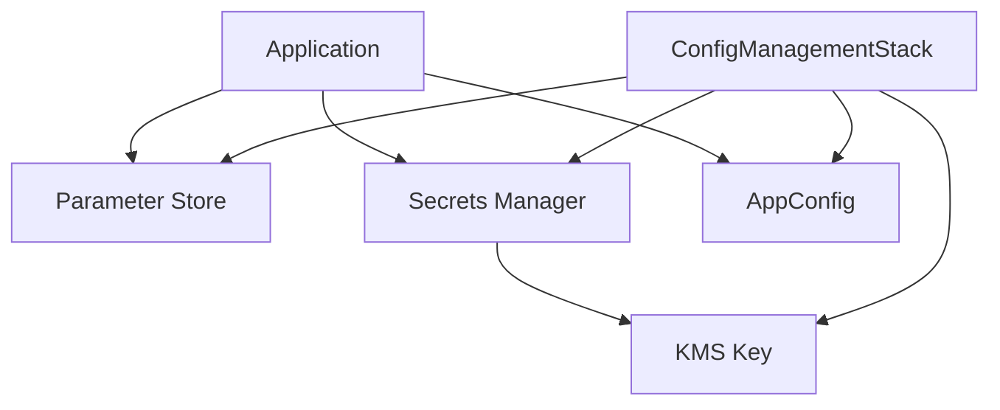

# Configuration Management System

This document explains the configuration management system implemented in the AWS Synapsed Bootstrap project.

## Overview

The configuration management system uses three AWS services to manage different types of configurations:

1. **AWS Systems Manager Parameter Store**: For non-sensitive configuration values
2. **AWS Secrets Manager**: For sensitive data like API keys and credentials
3. **AWS AppConfig**: For feature flags and dynamic configuration

## Architecture



## Components

### 1. ConfigManagementStack

The `ConfigManagementStack` is a CDK stack that sets up the infrastructure for configuration management:

```typescript
// Example usage
const configStack = new ConfigManagementStack(app, 'ConfigStack', {
  environment: 'dev',
  projectName: 'aws-synapsed-bootstrap',
  enableKmsEncryption: true,  // Optional: Enable KMS encryption for secrets
  retentionDays: 30,          // Optional: Set KMS key retention period
  parameterPrefix: '/custom/params',  // Optional: Custom prefix for Parameter Store
  secretPrefix: '/custom/secrets',    // Optional: Custom prefix for Secrets Manager
  applicationPrefix: 'custom-app'     // Optional: Custom prefix for AppConfig
});
```

#### Features:
- Creates Parameter Store parameter with configurable prefix
- Sets up Secrets Manager secret with configurable prefix and KMS encryption
- Configures AppConfig application, environment, profile, and hosted configuration
- Creates necessary IAM roles and permissions
- Optional KMS key for secret encryption with configurable retention period

### 2. Resource Naming

All resources follow a consistent naming convention:
- Default: `{projectName}-{environment}-{resourceName}`
- With prefix: `{prefix}/{projectName}-{environment}-{resourceName}`

Example:
- Parameter Store: `/custom/params/test-project-dev-config`
- Secrets Manager: `/custom/secrets/test-project-dev-config`
- AppConfig: `custom-app-test-project-dev-config`

## Configuration Structure

### Parameter Store
```typescript
{
  Name: 'test-project-dev-config',
  Type: 'String',
  Value: 'Default configuration value',
  Description: 'Central configuration parameter',
  Tier: 'Standard'
}
```

### Secrets Manager
```typescript
{
  Name: 'test-project-dev-config',
  Description: 'Central configuration secret',
  GenerateSecretString: {
    GenerateStringKey: 'password',
    SecretStringTemplate: '{"username":"admin"}',
    ExcludePunctuation: true,
    PasswordLength: 16,
    ExcludeCharacters: ' %+~`#$&*()|[]{}:;<>?!\'/,"\\'
  }
}
```

### AppConfig
```typescript
// Application
{
  Name: 'test-project-dev-config',
  Description: 'Central configuration application'
}

// Environment
{
  Name: 'test-project-dev-config-env',
  Description: 'Central configuration environment'
}

// Configuration Profile
{
  Name: 'test-project-dev-config-profile',
  Description: 'Central configuration profile',
  LocationUri: 'hosted',
  Type: 'AWS.Freeform',
  Validators: [{
    Type: 'JSON_SCHEMA',
    Content: '{"type":"object","properties":{"version":{"type":"string"},"settings":{"type":"object"}},"required":["version","settings"]}'
  }]
}

// Hosted Configuration Version
{
  Content: '{"version":"1.0.0","config":{"key":"value"}}',
  ContentType: 'application/json',
  Description: 'Initial configuration version'
}
```

## Security

### IAM Permissions
The system uses the principle of least privilege:

1. **AppConfig Role**:
   ```json
   {
     "Version": "2012-10-17",
     "Statement": [
       {
         "Effect": "Allow",
         "Action": [
           "appconfig:GetConfiguration",
           "appconfig:GetConfigurationProfile",
           "appconfig:GetEnvironment",
           "appconfig:ListApplications",
           "appconfig:ListConfigurationProfiles",
           "appconfig:ListEnvironments",
           "appconfig:ListHostedConfigurationVersions",
           "appconfig:StartDeployment",
           "appconfig:StopDeployment"
         ],
         "Resource": "*"
       }
     ]
   }
   ```

### Encryption
- Parameter Store: Uses AWS KMS for encryption (optional)
- Secrets Manager: Automatically encrypts secrets with optional KMS key
- AppConfig: Uses Parameter Store encryption

## Best Practices

1. **Parameter Naming**
   - Use hierarchical naming with environment and project name
   - Use custom prefixes for better organization
   - Use descriptive names

2. **Secret Management**
   - Enable KMS encryption for sensitive secrets
   - Configure appropriate retention periods
   - Use separate secrets per environment

3. **AppConfig Usage**
   - Use JSON schema validation for configurations
   - Use versioned configurations
   - Use environment-specific settings

## Migration from .env

To migrate from .env to the new system:

1. **Identify Configuration Types**:
   - Non-sensitive → Parameter Store
   - Sensitive → Secrets Manager
   - Feature flags → AppConfig

2. **Migration Steps**:
   ```typescript
   // Before
   const value = process.env.MY_CONFIG;

   // After
   const value = await configManager.getParameter('my-config');
   ```

3. **Update Dependencies**:
   ```json
   {
     "dependencies": {
       "@aws-sdk/client-ssm": "^3.772.0",
       "@aws-sdk/client-secrets-manager": "^3.772.0",
       "@aws-sdk/client-appconfig": "^3.772.0"
     }
   }
   ```

## Troubleshooting

### Common Issues

1. **Permission Errors**
   - Check IAM roles
   - Verify resource ARNs
   - Check environment variables

2. **Parameter Not Found**
   - Verify parameter name
   - Check environment
   - Check parameter path

3. **Secret Access Issues**
   - Verify secret exists
   - Check encryption key
   - Verify IAM permissions

### Debugging

```typescript
// Enable debug logging
const configManager = new ConfigManager('aws-synapsed-bootstrap', 'dev', {
  debug: true
});
```

## Related Resources

- [AWS Systems Manager Parameter Store](https://docs.aws.amazon.com/systems-manager/latest/userguide/systems-manager-parameter-store.html)
- [AWS Secrets Manager](https://docs.aws.amazon.com/secretsmanager/latest/userguide/intro.html)
- [AWS AppConfig](https://docs.aws.amazon.com/appconfig/latest/userguide/what-is-appconfig.html)
- [AWS CDK](https://docs.aws.amazon.com/cdk/latest/guide/home.html) 