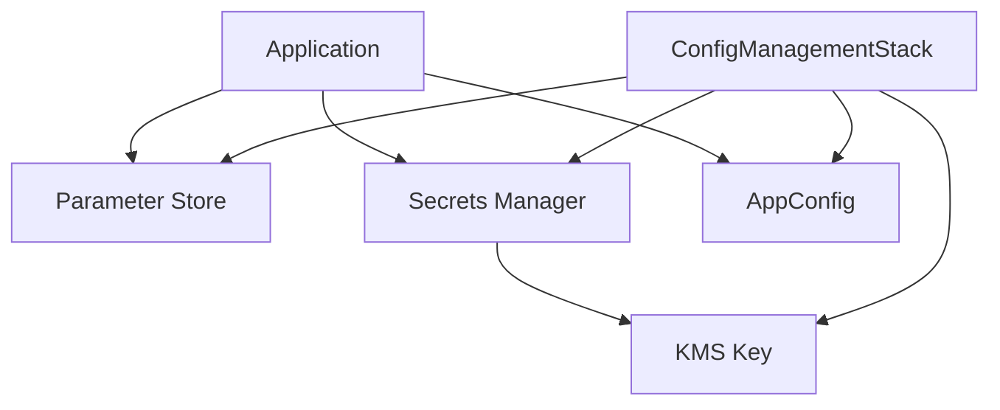

# Configuration Management System

This document explains the configuration management system implemented in the AWS Synapsed Bootstrap project.

## Overview

The configuration management system uses three AWS services to manage different types of configurations:

1. **AWS Systems Manager Parameter Store**: For non-sensitive configuration values
2. **AWS Secrets Manager**: For sensitive data like API keys and credentials
3. **AWS AppConfig**: For feature flags and dynamic configuration

## Architecture



## Components

### 1. ConfigManagementStack

The `ConfigManagementStack` is a CDK stack that sets up the infrastructure for configuration management:

```typescript
// Example usage
const configStack = new ConfigManagementStack(app, 'ConfigStack', {
  environment: 'dev',
  projectName: 'aws-synapsed-bootstrap',
  enableKmsEncryption: true,  // Optional: Enable KMS encryption for secrets
  retentionDays: 30,          // Optional: Set KMS key retention period
  parameterPrefix: '/custom/params',  // Optional: Custom prefix for Parameter Store
  secretPrefix: '/custom/secrets',    // Optional: Custom prefix for Secrets Manager
  applicationPrefix: 'custom-app'     // Optional: Custom prefix for AppConfig
});
```

#### Features:
- Creates Parameter Store parameter with configurable prefix
- Sets up Secrets Manager secret with configurable prefix and KMS encryption
- Configures AppConfig application, environment, profile, and hosted configuration
- Creates necessary IAM roles and permissions
- Optional KMS key for secret encryption with configurable retention period

### 2. Resource Naming

All resources follow a consistent naming convention:
- Default: `{projectName}-{environment}-{resourceName}`
- With prefix: `{prefix}/{projectName}-{environment}-{resourceName}`

Example:
- Parameter Store: `/custom/params/test-project-dev-config`
- Secrets Manager: `/custom/secrets/test-project-dev-config`
- AppConfig: `custom-app-test-project-dev-config`

## Configuration Structure

### Parameter Store
```typescript
{
  Name: 'test-project-dev-config',
  Type: 'String',
  Value: 'Default configuration value',
  Description: 'Central configuration parameter',
  Tier: 'Standard'
}
```

### Secrets Manager
```typescript
{
  Name: 'test-project-dev-config',
  Description: 'Central configuration secret',
  GenerateSecretString: {
    GenerateStringKey: 'password',
    SecretStringTemplate: '{"username":"admin"}',
    ExcludePunctuation: true,
    PasswordLength: 16,
    ExcludeCharacters: ' %+~`#$&*()|[]{}:;<>?!\'/,"\\'
  }
}
```

### AppConfig
```typescript
// Application
{
  Name: 'test-project-dev-config',
  Description: 'Central configuration application'
}

// Environment
{
  Name: 'test-project-dev-config-env',
  Description: 'Central configuration environment'
}

// Configuration Profile
{
  Name: 'test-project-dev-config-profile',
  Description: 'Central configuration profile',
  LocationUri: 'hosted',
  Type: 'AWS.Freeform',
  Validators: [{
    Type: 'JSON_SCHEMA',
    Content: '{"type":"object","properties":{"version":{"type":"string"},"settings":{"type":"object"}},"required":["version","settings"]}'
  }]
}

// Hosted Configuration Version
{
  Content: '{"version":"1.0.0","config":{"key":"value"}}',
  ContentType: 'application/json',
  Description: 'Initial configuration version'
}
```

## Security

### IAM Permissions
The system uses the principle of least privilege:

1. **AppConfig Role**:
   ```json
   {
     "Version": "2012-10-17",
     "Statement": [
       {
         "Effect": "Allow",
         "Action": [
           "appconfig:GetConfiguration",
           "appconfig:GetConfigurationProfile",
           "appconfig:GetEnvironment",
           "appconfig:ListApplications",
           "appconfig:ListConfigurationProfiles",
           "appconfig:ListEnvironments",
           "appconfig:ListHostedConfigurationVersions",
           "appconfig:StartDeployment",
           "appconfig:StopDeployment"
         ],
         "Resource": "*"
       }
     ]
   }
   ```

### Encryption
- Parameter Store: Uses AWS KMS for encryption (optional)
- Secrets Manager: Automatically encrypts secrets with optional KMS key
- AppConfig: Uses Parameter Store encryption

## Best Practices

1. **Parameter Naming**
   - Use hierarchical naming with environment and project name
   - Use custom prefixes for better organization
   - Use descriptive names

2. **Secret Management**
   - Enable KMS encryption for sensitive secrets
   - Configure appropriate retention periods
   - Use separate secrets per environment

3. **AppConfig Usage**
   - Use JSON schema validation for configurations
   - Use versioned configurations
   - Use environment-specific settings

## Migration from .env

To migrate from .env to the new system:

1. **Identify Configuration Types**:
   - Non-sensitive → Parameter Store
   - Sensitive → Secrets Manager
   - Feature flags → AppConfig

2. **Migration Steps**:
   ```typescript
   // Before
   const value = process.env.MY_CONFIG;

   // After
   const value = await configManager.getParameter('my-config');
   ```

3. **Update Dependencies**:
   ```json
   {
     "dependencies": {
       "@aws-sdk/client-ssm": "^3.772.0",
       "@aws-sdk/client-secrets-manager": "^3.772.0",
       "@aws-sdk/client-appconfig": "^3.772.0"
     }
   }
   ```

## Troubleshooting

### Common Issues

1. **Permission Errors**
   - Check IAM roles
   - Verify resource ARNs
   - Check environment variables

2. **Parameter Not Found**
   - Verify parameter name
   - Check environment
   - Check parameter path

3. **Secret Access Issues**
   - Verify secret exists
   - Check encryption key
   - Verify IAM permissions

### Debugging

```typescript
// Enable debug logging
const configManager = new ConfigManager('aws-synapsed-bootstrap', 'dev', {
  debug: true
});
```

## Related Resources

- [AWS Systems Manager Parameter Store](https://docs.aws.amazon.com/systems-manager/latest/userguide/systems-manager-parameter-store.html)
- [AWS Secrets Manager](https://docs.aws.amazon.com/secretsmanager/latest/userguide/intro.html)
- [AWS AppConfig](https://docs.aws.amazon.com/appconfig/latest/userguide/what-is-appconfig.html)
- [AWS CDK](https://docs.aws.amazon.com/cdk/latest/guide/home.html)

## Core Components

### 1. Parameter Store

The Parameter Store is used for non-sensitive configuration:

```typescript
// Example parameter store configuration
interface ParameterStoreConfig {
  security: {
    auditRoleName: string;
    loggingRoleName: string;
    securityTeamEmail: string;
    securityTeamPhone?: string;
  };
  logging: {
    logRetentionDays: number;
    logArchiveBucketName: string;
  };
  monitoring: {
    guardDutyEnabled: boolean;
    securityHubEnabled: boolean;
    findingPublishingFrequency: number;
  };
  compliance: {
    configRules: ConfigRule[];
    deliveryChannel: DeliveryChannelConfig;
  };
  websocket: {
    redisEndpoint: string;
    redisPort: number;
    connectionTimeout: number;
  };
}
```

### 2. Secrets Manager

Secrets Manager is used for sensitive configuration:

```typescript
// Example secrets configuration
interface SecretsConfig {
  redis: {
    password: string;
    tlsCertificate: string;
  };
  api: {
    jwtSecret: string;
    apiKey: string;
  };
  aws: {
    accessKeyId: string;
    secretAccessKey: string;
  };
}
```

### 3. AppConfig

AppConfig is used for feature flags and dynamic configuration:

```typescript
// Example AppConfig configuration
interface AppConfig {
  features: {
    websocket: {
      enabled: boolean;
      maxConnections: number;
      messageSizeLimit: number;
    };
    api: {
      rateLimit: number;
      timeout: number;
    };
    monitoring: {
      logLevel: string;
      metricsEnabled: boolean;
    };
  };
  environment: {
    name: string;
    region: string;
    account: string;
  };
}
```

## Configuration Structure

### 1. Environment Configuration

```typescript
// Example environment configuration
interface EnvironmentConfig {
  development: {
    websocket: {
      redisEndpoint: 'dev-redis.example.com';
      redisPort: 6379;
      connectionTimeout: 10000;
    };
    api: {
      baseUrl: 'https://dev-api.example.com';
      timeout: 5000;
    };
  };
  production: {
    websocket: {
      redisEndpoint: 'prod-redis.example.com';
      redisPort: 6379;
      connectionTimeout: 10000;
    };
    api: {
      baseUrl: 'https://api.example.com';
      timeout: 5000;
    };
  };
}
```

### 2. WebSocket Configuration

```typescript
// Example WebSocket configuration
interface WebSocketConfig {
  api: {
    name: string;
    description: string;
    routes: {
      connect: RouteConfig;
      disconnect: RouteConfig;
      default: RouteConfig;
      resolveDID: RouteConfig;
    };
  };
  redis: {
    endpoint: string;
    port: number;
    connectionTimeout: number;
    tls: {
      enabled: boolean;
      rejectUnauthorized: boolean;
    };
    password: string;
  };
  dynamodb: {
    tableName: string;
    region: string;
    readCapacity: number;
    writeCapacity: number;
  };
}
```

## Configuration Management

### 1. Parameter Store Management

```typescript
// Example parameter store management
class ParameterStoreManager {
  constructor(private ssm: SSMClient) {}

  async getParameter(name: string): Promise<string> {
    const command = new GetParameterCommand({
      Name: name,
      WithDecryption: false
    });
    const response = await this.ssm.send(command);
    return response.Parameter?.Value || '';
  }

  async putParameter(name: string, value: string): Promise<void> {
    const command = new PutParameterCommand({
      Name: name,
      Value: value,
      Type: 'String'
    });
    await this.ssm.send(command);
  }
}
```

### 2. Secrets Management

```typescript
// Example secrets management
class SecretsManager {
  constructor(private secrets: SecretsManagerClient) {}

  async getSecret(name: string): Promise<string> {
    const command = new GetSecretValueCommand({
      SecretId: name
    });
    const response = await this.secrets.send(command);
    return response.SecretString || '';
  }

  async putSecret(name: string, value: string): Promise<void> {
    const command = new PutSecretValueCommand({
      SecretId: name,
      SecretString: value
    });
    await this.secrets.send(command);
  }
}
```

### 3. AppConfig Management

```typescript
// Example AppConfig management
class AppConfigManager {
  constructor(private appconfig: AppConfigClient) {}

  async getConfiguration(name: string): Promise<AppConfig> {
    const command = new GetConfigurationCommand({
      Application: name,
      Environment: process.env.ENVIRONMENT || 'development'
    });
    const response = await this.appconfig.send(command);
    return JSON.parse(response.Content || '{}');
  }

  async putConfiguration(name: string, config: AppConfig): Promise<void> {
    const command = new PutConfigurationCommand({
      Application: name,
      Environment: process.env.ENVIRONMENT || 'development',
      Content: JSON.stringify(config)
    });
    await this.appconfig.send(command);
  }
}
```

## Recent Improvements

### 1. AWS SDK v3 Migration

- Updated configuration clients to use AWS SDK v3
- Improved error handling and type safety
- Enhanced performance and reliability
- Better integration with TypeScript

### 2. Configuration Validation

```typescript
// Example configuration validation
function validateConfig(config: Config): void {
  if (!config.security.auditRoleName) {
    throw new Error('Security audit role name is required');
  }
  if (config.logging.logRetentionDays < 30) {
    throw new Error('Log retention must be at least 30 days');
  }
  if (!config.websocket.redisEndpoint) {
    throw new Error('Redis endpoint is required');
  }
}
```

### 3. Environment Management

- Improved environment variable handling
- Better type safety for environment variables
- Enhanced validation and error messages
- Cleaner configuration structure

## Future Improvements

### 1. Configuration Versioning

- Implement configuration versioning
- Add rollback capabilities
- Track configuration changes
- Audit configuration history

### 2. Dynamic Updates

- Real-time configuration updates
- Zero-downtime updates
- Configuration change notifications
- Update validation

### 3. Monitoring and Alerts

- Configuration change monitoring
- Validation failure alerts
- Performance metrics
- Usage analytics

## Best Practices

### 1. Configuration Organization

- Clear naming conventions
- Logical grouping
- Environment separation
- Access control

### 2. Security

- Sensitive data encryption
- Access control
- Audit logging
- Regular rotation

### 3. Maintenance

- Regular cleanup
- Version management
- Documentation updates
- Performance optimization

## Support

### 1. Troubleshooting

- Common issues
- Resolution steps
- Log analysis
- Performance tuning

### 2. Documentation

- Configuration guide
- API reference
- Examples
- Best practices

### 3. Training

- Configuration management
- Security practices
- Maintenance procedures
- Troubleshooting 